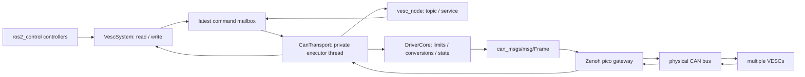

# 構成・スレッド・複数台

通常ノードとプラグインはどちらかを選びます。同じ ID を両方から制御しません。
VescSystem は実行ファイルではなく、controller_manager のプロセスへロードする
共有ライブラリです。System 1 つで複数の VESC を管理し、CAN 送受信ノードと
専用 executor スレッドを各 1 つ持ちます。モータごとの ROS ノードやスレッドは
作りません。controller_manager、コントローラ、ROS ミドルウェアのスレッドは別に存在します。

通常ノードは 1 プロセスで、トピック API のノードと CAN I/O の内部ノードの
2 つを持ちます。メイン executor と CAN executor がそれぞれ動きます。
「ROS グラフ上のノードが 1 つ」という構成ではありません。

## 制御周期との境界

hardware read/write は、起動時に確保した配列とインターフェースハンドルを使用します。
read は状態のコピー、write は最新指令を共有領域へ渡す処理で、ROS publish や
ネットワーク待機を行いません。共有領域と ros2_control ハンドルのアクセスは
待機しない try-lock 方式です。競合した周期は以前の状態を使う／書き込みを次周期へ
延期します。鮮度期限の検査は続けるため、無期限に古い指令を使い続けません。

CAN executor が一定周期で最新指令を取り出し、変換・制限・異常検査・Frame 送信を
行います。通常ノードでは Float64 の単一モータ／JointState の複数関節指令を、hardware では全関節の指令を
まとめて受け渡します。中間の指令はまとめられ、motor 数を超える指令キューは作りません。
受信コールバックは同じ executor で STATUS を状態へ反映します。

std::thread は join してから状態を破棄します。自分の executor だけを cancel し、
controller_manager の executor を停止しません。C++ の例外は起動・設定・専用
executor の境界で処理し、デストラクタから例外を出しません。

この方式は soft real-time です。mutex の共有、ROS ミドルウェア、OS スケジューラ、
ネットワークの遅延があるため hard real-time は保証しません。
専用スレッドを追加するだけで制御の決定性が保証されるわけではありません。
重い最適化やスレッドの増設は、実機で周期・CPU・CAN 負荷を測定してから判断します。

## 4 輪独立駆動・操舵の例

1 CAN バスなら System を 1 つ作り、駆動 4 関節 + 操舵 4 関節の計 8 関節を登録します。
同じ CAN Tx/Rx にまとめ、各関節へ固有の controller_id を割り当てます。
別バスの場合は System を分け、Tx/Rx のトピックも分けます。必要なフィードバックを
1 台でも失うと、その System 内の全 VESC を停止します。

8 台へ 100 Hz で送信すると指令は 800 frames/s。STATUS1/4/5 を各 50 Hz で
全台から受信するなら 1200 frames/s、合計 2000 frames/s です。
1 フレーム約 160 bit として余裕を見た概算は 320 kbit/s。
1 Mbit/s CAN の約 32%、500 kbit/s の約 64% に相当します。
これは DLC・bit stuffing・他ノード・再送などで変わる概算で、測定値ではありません。
必要な STATUS と周期を選び、バス負荷を測定してください。

検証はまず模擬 2 台での機能確認です。8 台以上での負荷試験、Zenoh pico を含む
途絶・遅延試験、実 VESC での角度・電流・停止の確認は今後の実機導入作業です。

## 外部パッケージとの関係

[sbgisen/vesc](https://github.com/sbgisen/vesc/tree/jazzy-devel) には
ros2_control の ActuatorInterface があり、USB/UART 接続では有用な候補です。
確認した Jazzy ブランチはシリアルポートと VESC パケットを使用します。
本パッケージの native CAN Frame + Zenoh pico 経路へそのまま接続できるものではありません。
通信の置き換え、CAN STATUS の状態取得、複数関節の System 化が必要です。
本実装は同プロジェクトのコードをコピーせず、CAN 境界を共有する構成を採用します。

通常ノードの状態配信はモータごとに `vesc_msgs/msg/VescStateStamped` の publisher を
持ちます。同じ 1 つの状態配信タイマーで全台を処理し、モータごとのノードやスレッドは
追加しません。上流メッセージの生成はメイン executor の状態配信周期で行い、
ros2_control の read/write では行いません。STATUS1〜6 を解釈できる実装でも、
全 STATUS を常時送信する必要はありません。制御に必要な種類と診断用の低頻度データを
VESC Tool 側で選び、CAN と Zenoh の負荷を調整してください。
